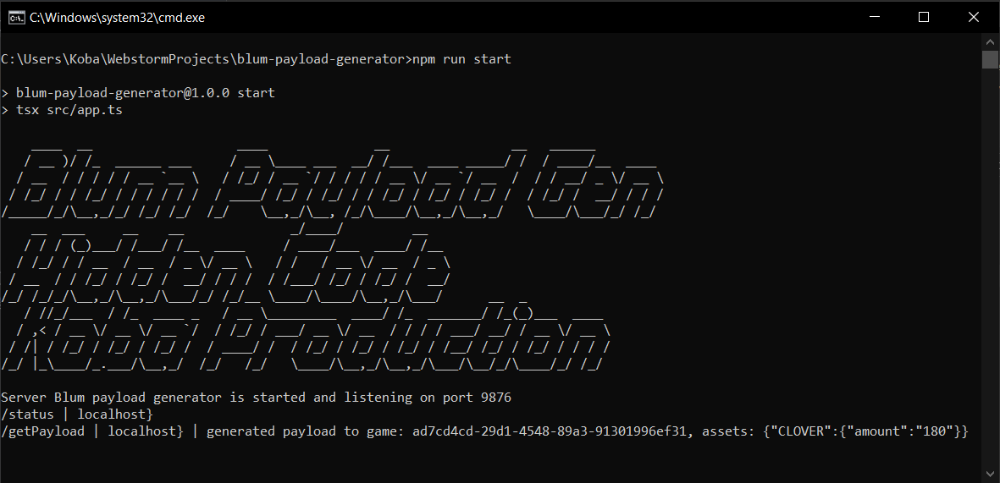

# Blum Payload Generator API 

available two methods:
1. GET `/status` - return `{"status": "ok}` if all ok
2. POST `/getPayload` - return payload and another data. 
   
    request body : `{"gameId": "ad7...", "earnedAssets": {"CLOVER": {"amount": "180"}}}` 

# Install

1. install node.js
2. open the project folder where the package.json file is located
3. use `npm install` command in shell

# Run payload server

use command: `npm run start`

# Partners and Friends
- [Koba Light Systems & Color Music](https://t.me/koba_light_systems) on Telegram. 
(A big request from the author of the script - subscribe as a sign of gratitude)
- [Koba Production](https://t.me/koba_production) on Telegram
- [HiddenCode](https://t.me/hidden_coding) on Telegram